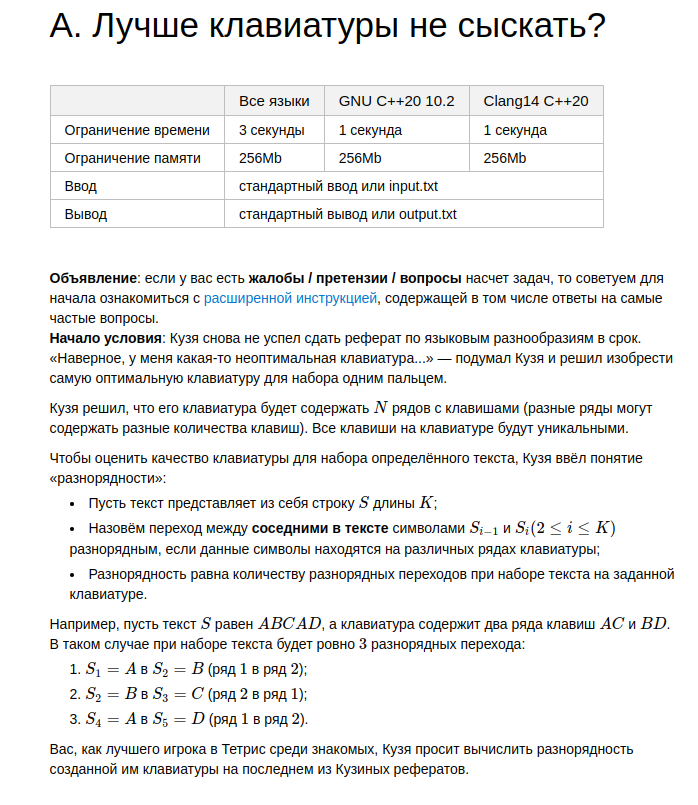

# A Task



```python
N = int(input())  # кол-во клавиш на клавиатуре
c = list(map(int, input().split()))  # сами симвроы
r = list(map(int, input().split()))  # номер ряда для каждого символа
K = int(input())  # количество символов в строке
s = list(map(int, input().split()))  # строка

translate = {key: value for key, value in zip(c, r)}

result = 0
prev_row = translate[s[0]]
for i in range(K):
    cur_row = translate[s[i]]
    if cur_row != prev_row:
        result += 1
    prev_row = translate[s[i]]
print(result)

```