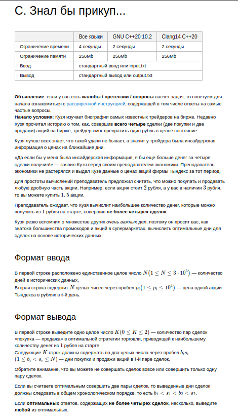
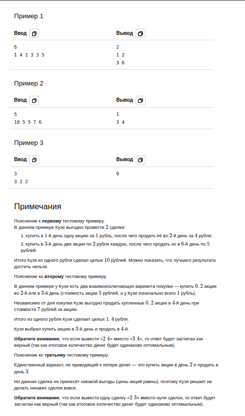

# C Task





```python
from collections import deque

N = int(input())
p = list(map(int, input().split()))

rubles = 1

result = []
queue = deque()
max_, min_ = [0, 0], N + 1

if len(set(p)) == 1:
    print(0)
else:
    for i in range(N):
        if p[i] > max_[0]:
            max_ = [p[i], i + 1]
        if p[i] < max_[0]:
            if queue:
                min_ = queue.popleft()
                if min_ != max_[1]:
                    result.append(f'{min_} {max_[1]}')
                queue.clear()
            max_ = [p[i], i + 1]
        queue.append(i + 1)

    if queue:
        min_ = queue.popleft()
        if min_ != max_[1]:
            result.append(f'{min_} {max_[1]}')
    if len(result) <= 2:
        print(len(result))
        for r in result:
            print(r)
    else:
        pairs = []
        for i in range(len(result) - 1):
            for j in range(i + 1, len(result)):
                if (result[i], result[j]) not in pairs and (result[j], result[i]) not in pairs:
                    pairs.append((result[i], result[j]))

        def benefit_from_1ruble(iterable):
            first_num, second_num = list(map(int, iterable[0].split()))
            first_ben = (1 / first_num) * (second_num - first_num)
            third_num, fourth_num = list(map(int, iterable[1].split()))
            second_ben = (first_ben / third_num) * (fourth_num - third_num)
            return round(second_ben, 2)

        benefit = list(
            map(benefit_from_1ruble, pairs)
        )

        benefit_idx = benefit.index(max(benefit))

        print(2, *pairs[benefit_idx], sep='\n')
```